# Anomaly detection in quasi-periodic energy consumption data series: a comparison of algorithms

In this folder you will find full-size versions of the figures in the article:

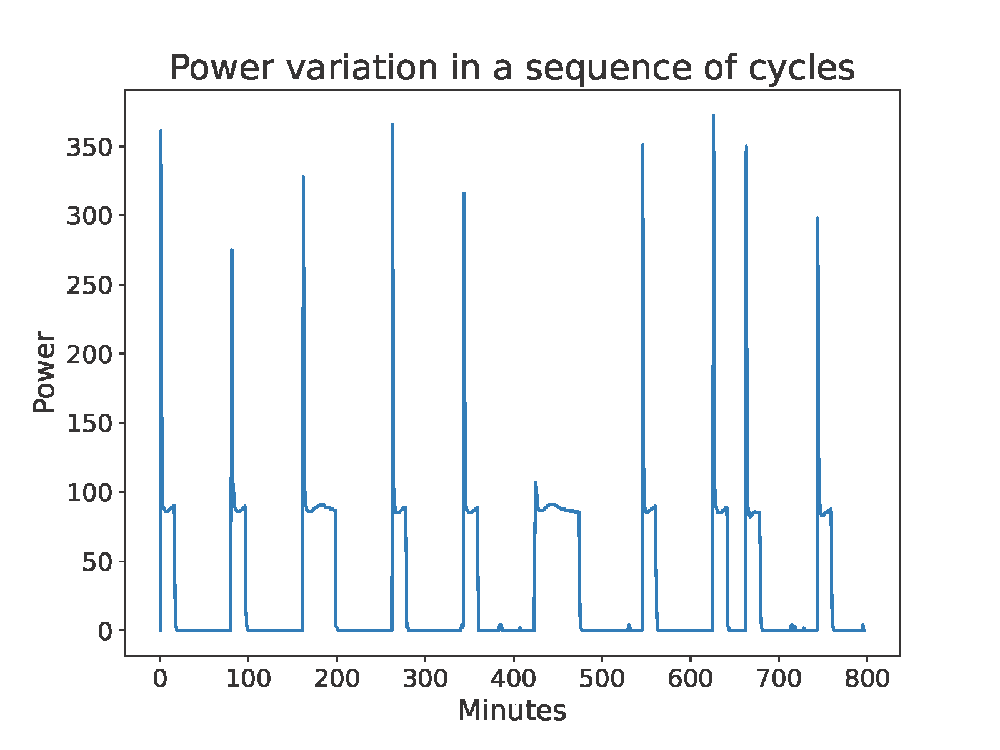

  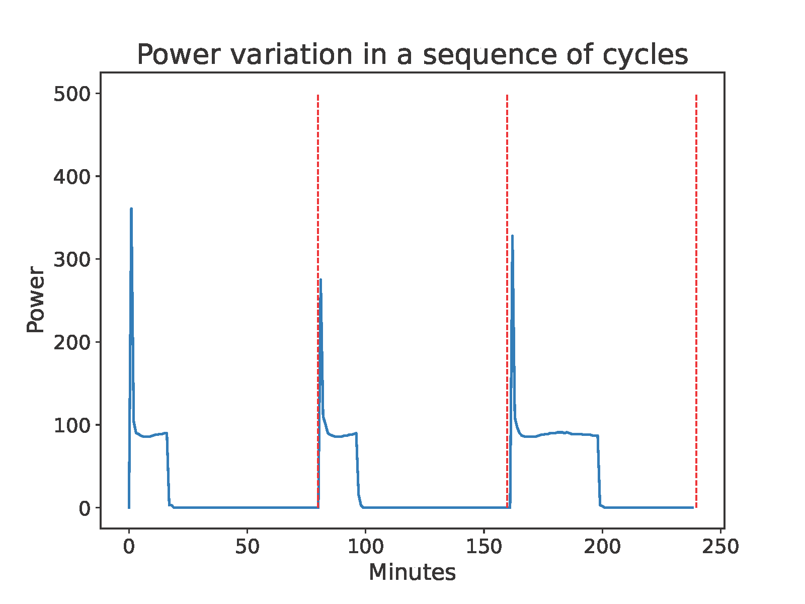
  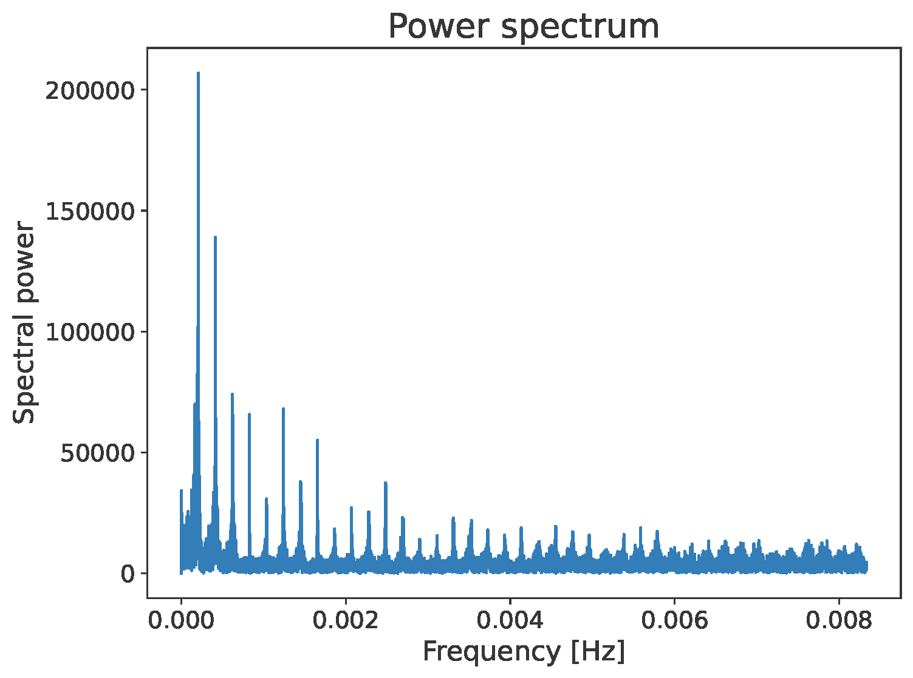

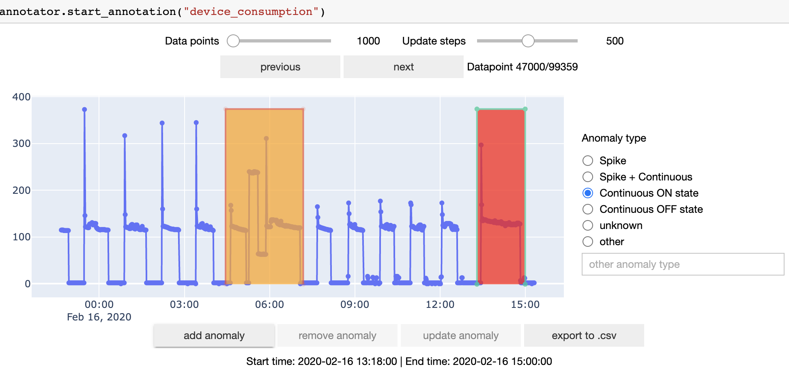

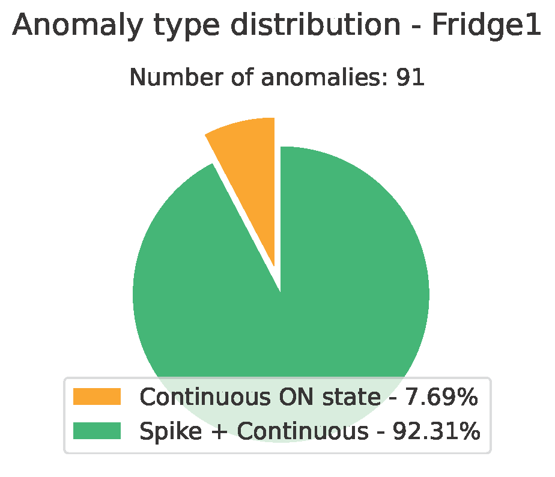
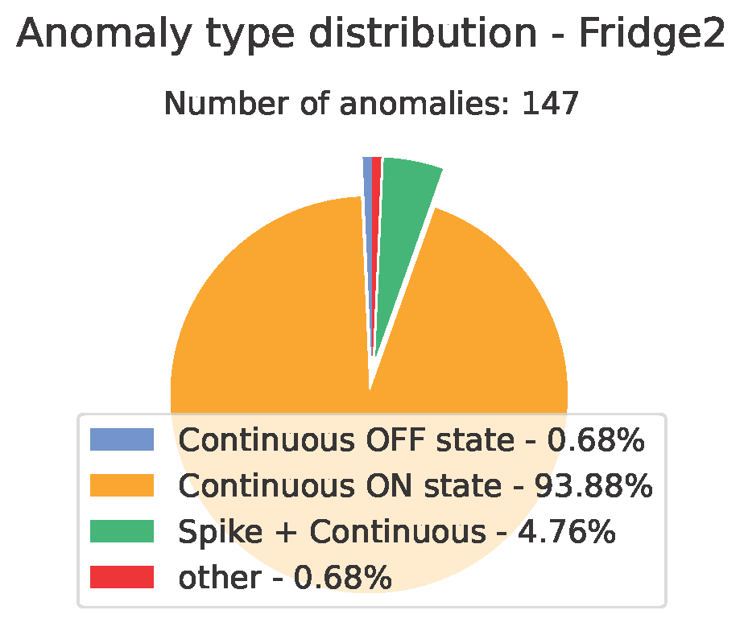
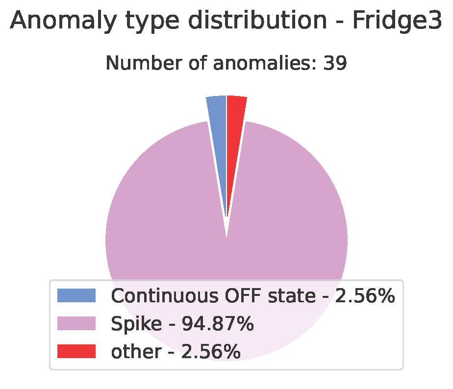

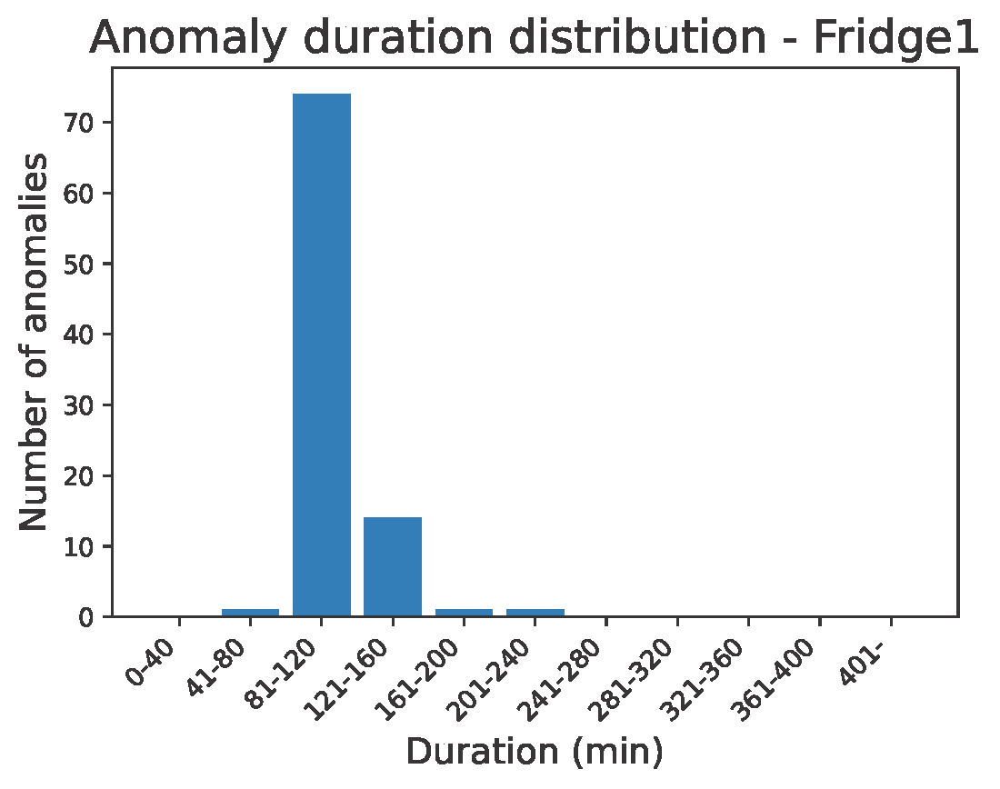
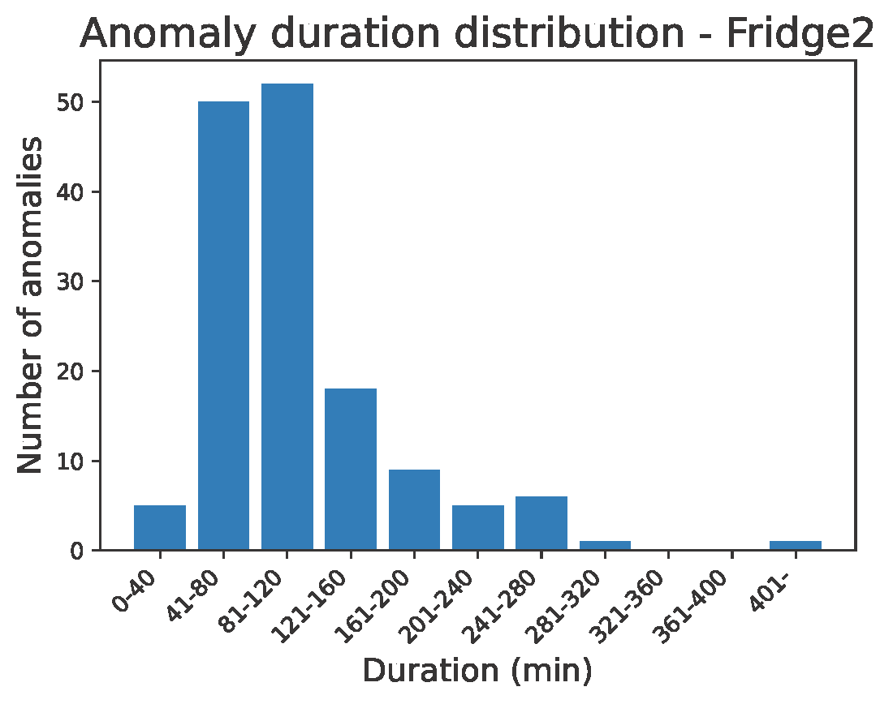
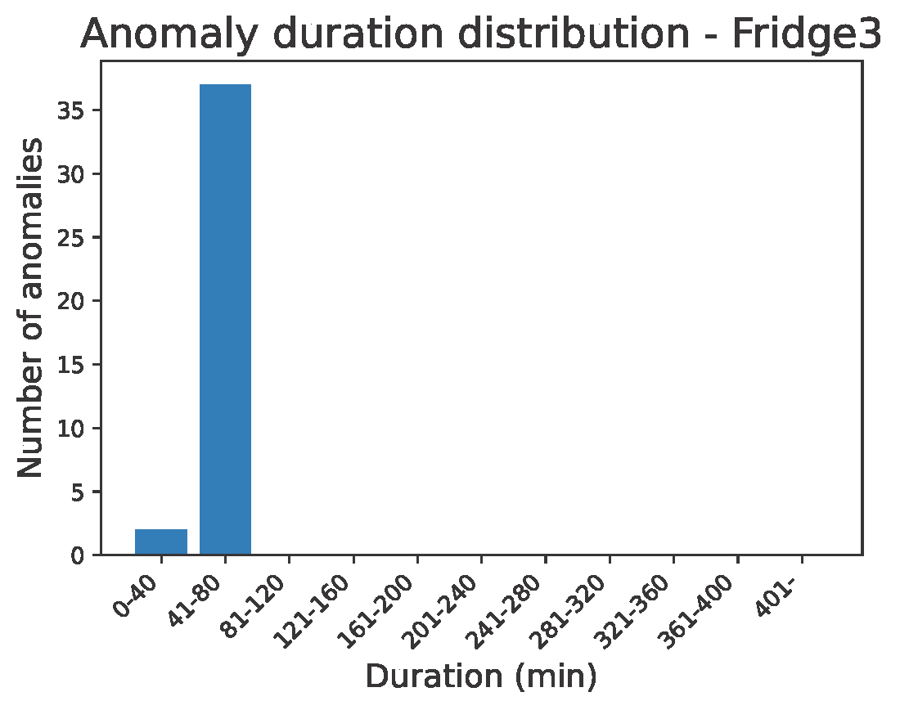

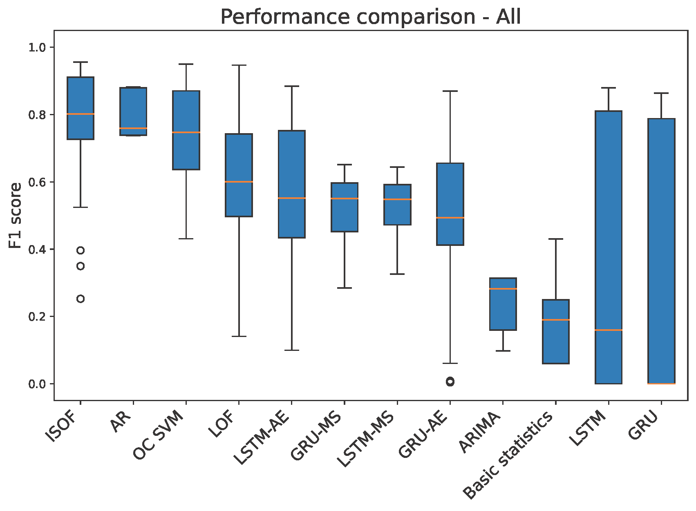

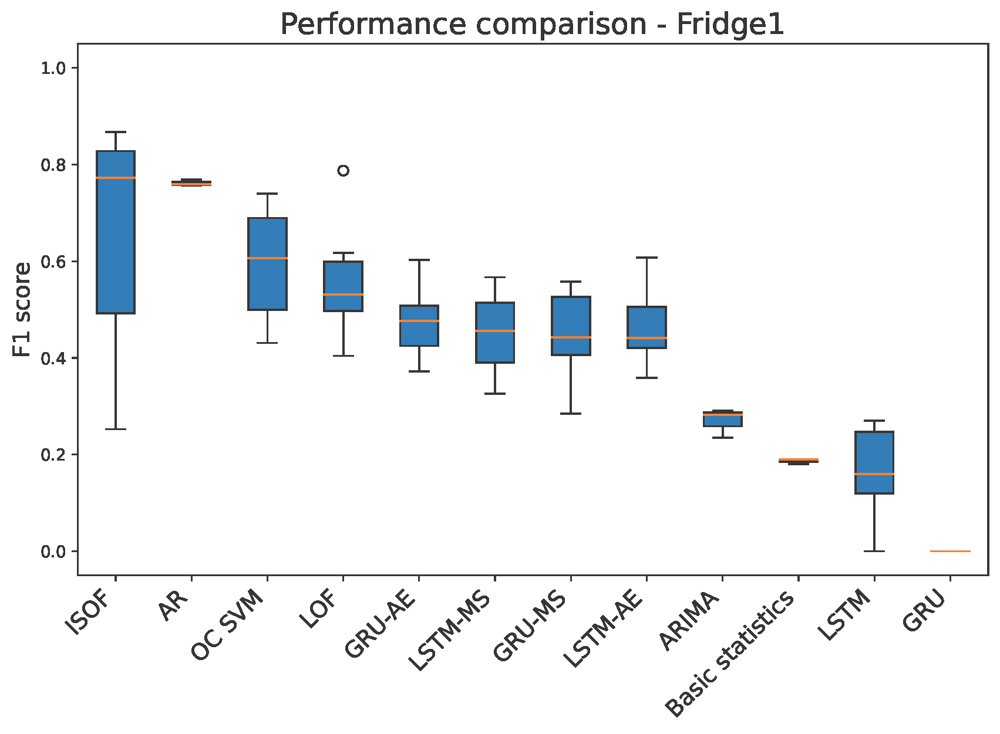
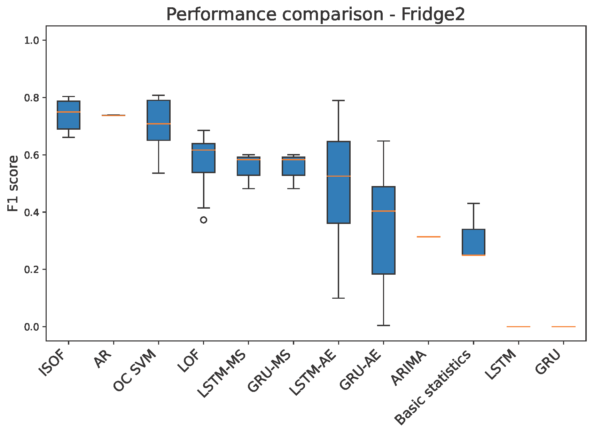
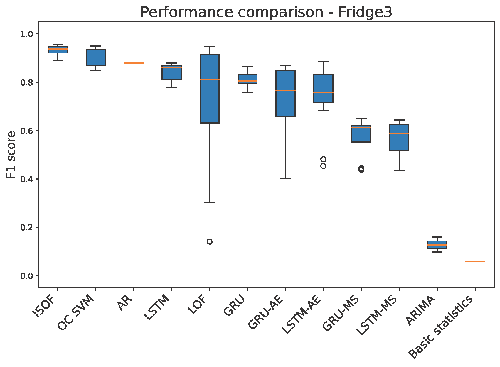

