# Anomaly detection in quasi-periodic energy consumption data series: a comparison of algorithms

In this folder you will find full-size versions of the figures in the article:

 <b>Fig1.</b> Example of the fridge energy consumption data series. The time series is formed by subsequent ON-OFF cycles and is quasi-periodical.

 &nbsp;

  
  
   <b>Fig2.</b> The power spectrum computed by the periodicity pre-processor (right) on the fridge energy consumption time series (left). The period detected for an ON-OFF cycle is about 80 minutes for the analyzed data set.

 &nbsp;

   <b>Fig3.</b> The interface of the GT anomaly annotator at work on the fridge time series. The user can specify the anomalies and add  meta-data to them.  The user has annotated the currently selected GT anomaly, shown in red, with the <i>Continuous ON state</i> label.

 &nbsp;

   <b>Fig4.</b> The anomaly type distribution on the three fridge energy consumption data series.

 &nbsp;

   <b>Fig5.</b> The anomaly duration distribution on the fridge energy consumption data sets.  The distributions of Fridge1 and Fridge2 are centered close the time series period, which suggests the presence of anomalies shorter than an ON-OFF cycle whereas the distribution of Fridge3 is centered around values higher than the mean ON-OFF cycle duration.

 &nbsp;

   <b>Fig6.</b> Comparison of the  performances of all the algorithms on all the  appliances and across all the training duration periods and window sizes. The methods are ordered in descending order of the median values of the F1 score.  

 &nbsp;

   <b>Fig7.</b> Break down of the performance of all the algorithms by appliance. The methods are ordered by descending median value of the F1 score. 

 &nbsp;

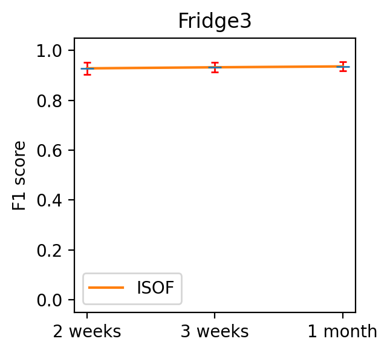
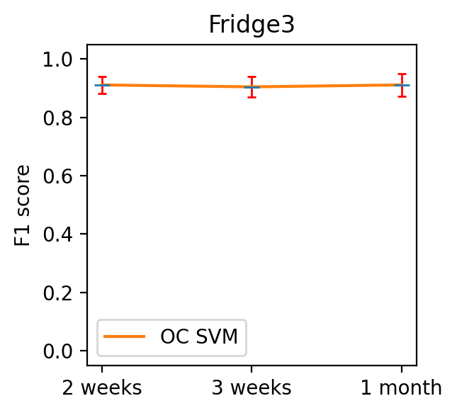
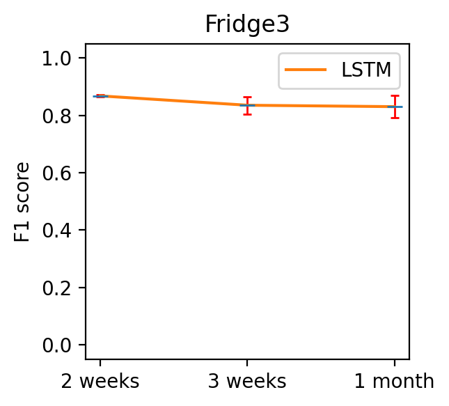
  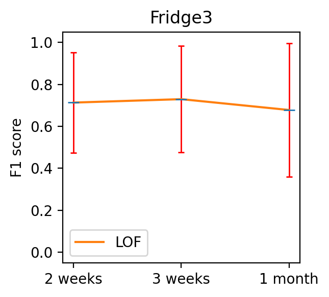

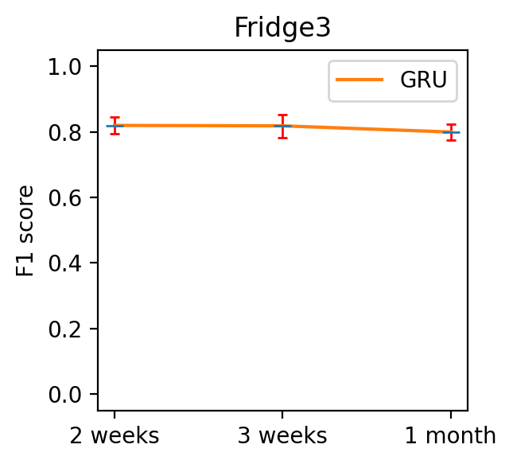

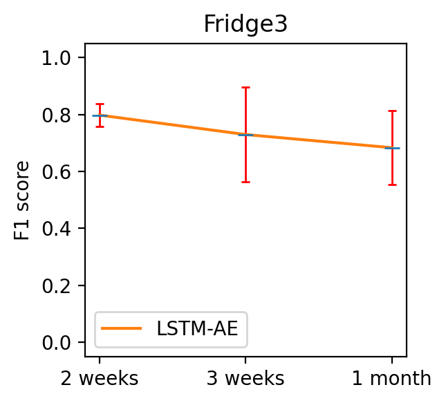

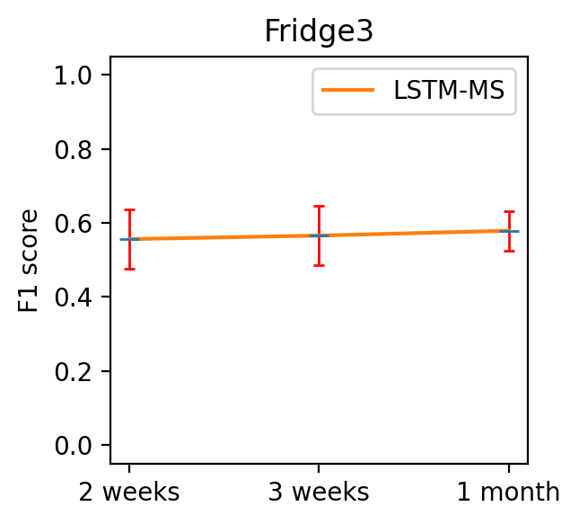

   <b>Fig8.</b> Variation of the F1 score with the duration of the training sub-sequence. The AR and ARIMA method did not complete the training with all the periods.

 &nbsp;

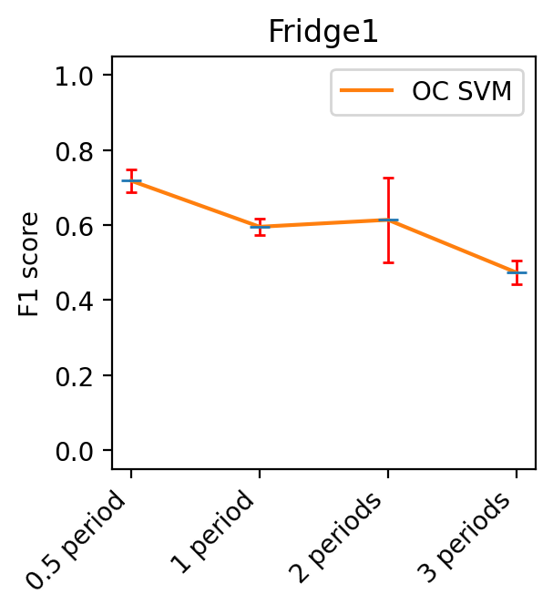

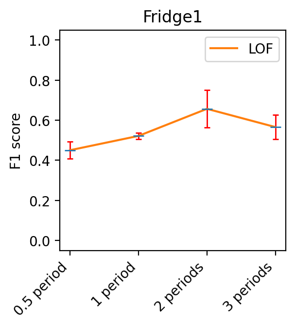

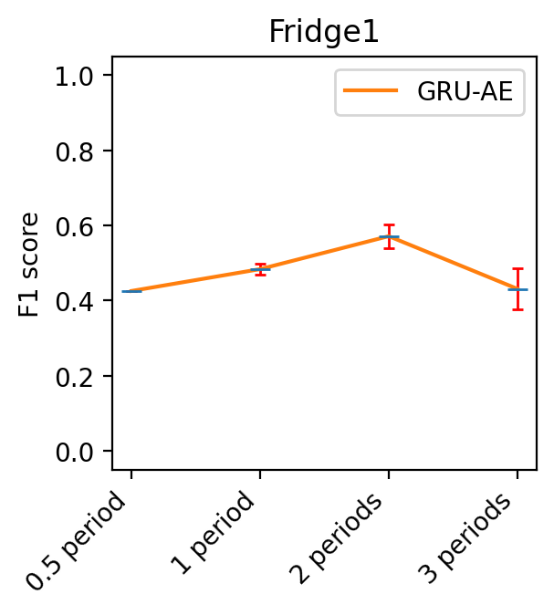
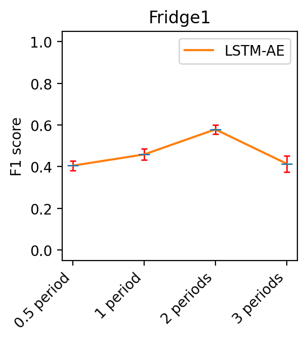
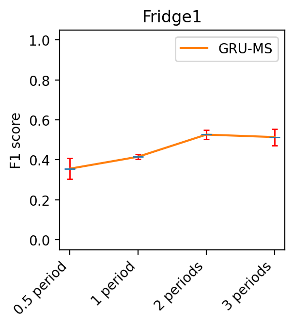

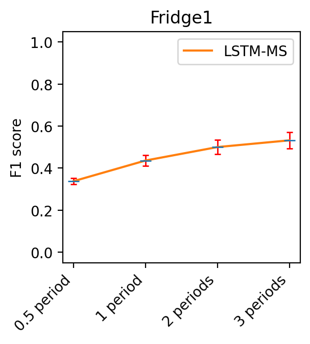
   <b>Fig9.</b> Variation of the  F1 score with the size (in periods) of the sliding window. The AR and ARIMA method did not complete the training with all the periods.

 &nbsp;

 <b>Fig10.</b> Comparison of the generalization performance of the top-5 methods. The orange bar represents the baseline F1 value (i.e., training and testing done on the same dataset), the blue bar denotes the F1 value achieved by fine tuning the threshold on the validation set of the target appliance, and the green bar shows the performances obtained using the trained algorithm without fine tuning.

 &nbsp;

